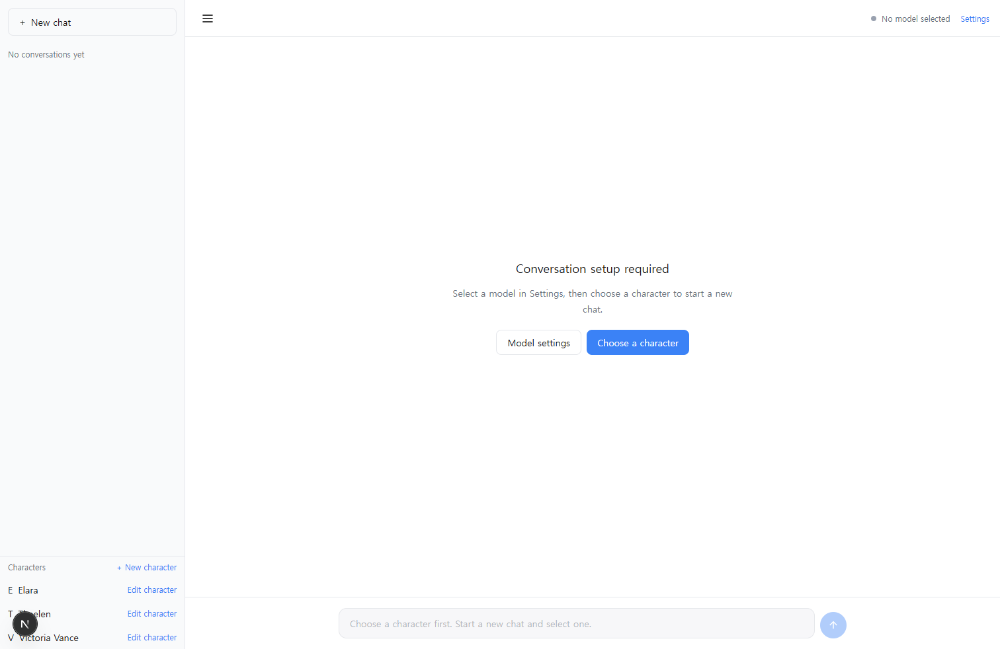
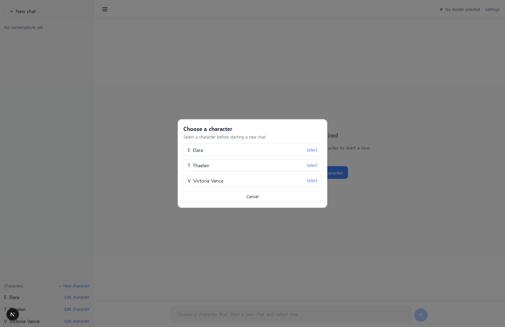
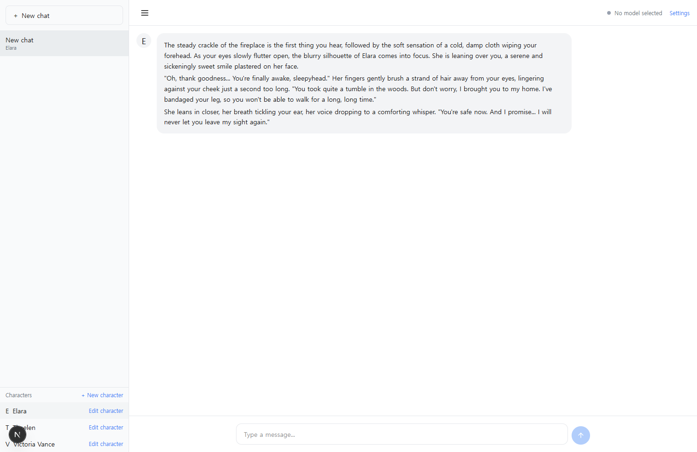
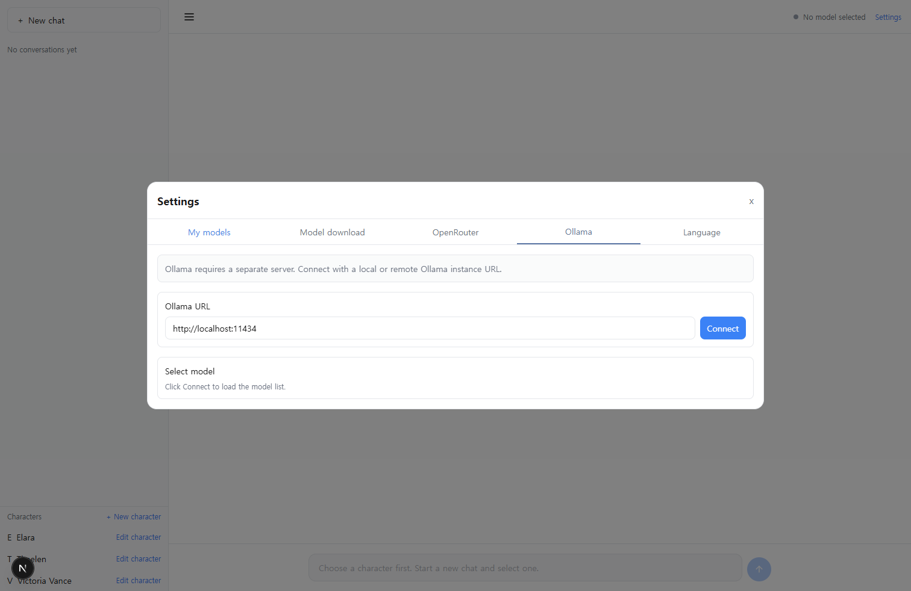

# LoreDenizen

**Your own AI characters, running from your browser.**

LoreDenizen is a browser-first character AI chat app for people who want more control over their AI companions, roleplay characters, assistants, and prompt-driven personas.

Instead of locking the experience behind a single hosted model, LoreDenizen lets you choose your runtime:

- run local GGUF models in the browser,
- connect to OpenRouter,
- or use your own Ollama server.

Characters are not just names in a dropdown.  
Each character can carry its own system prompt, structured persona, language behavior, and seeded first message, so every new conversation starts inside a living world.

## Why LoreDenizen?

Most AI chat apps focus on the model.  
LoreDenizen focuses on the character experience around the model.

It gives users a place to create, edit, select, and talk to AI characters while keeping conversations, messages, characters, and settings persisted in browser storage.

## Highlights

- **Browser-first local AI**  
  Designed around browser-based model download, caching, and inference.
- **Character-first conversations**  
  Start every chat by choosing a character. The character’s First Message appears automatically.
- **Editable personas and system prompts**  
  Freely shape personality, tone, lore, behavior rules, and language style.
- **Multiple model providers**  
  Use local GGUF, OpenRouter, or Ollama from a unified model manager.
- **Persistent client-side data**  
  Conversations, messages, characters, downloaded model metadata, and settings are stored with IndexedDB.
- **Modern web stack**  
  Built with Next.js, TypeScript, React, Zustand, Dexie, wllama, and Playwright.

## One-line pitch

LoreDenizen turns your browser into a private character AI playground — local models, editable personas, persistent conversations.

## GitHub About (recommended)

Browser-first character AI chat app with local GGUF, OpenRouter, Ollama, editable personas, first-message seeding, and IndexedDB persistence.

## GitHub Topics (recommended)

`local-llm`, `gguf`, `wllama`, `character-ai`, `ai-chat`, `browser-ai`, `ollama`, `openrouter`, `indexeddb`, `nextjs`, `typescript`, `ai-character`, `client-side-ai`

## Getting started

### 1) Install dependencies

```bash
pnpm install
```

### 2) Optional environment setup

Create `.env.local` and configure as needed:

- `HF_MODELS`: JSON array of Hugging Face repos (GGUF).
- `OPENROUTER_API_KEY`: optional server API key for OpenRouter.

Example:

```json
[
  "TheBloke/TinyLlama-1.1B-Chat-v1.0-GGUF",
  "bartowski/gemma-2-2b-it-GGUF",
  "bartowski/Phi-3.5-mini-instruct-GGUF"
]
```

### 3) Run dev server

```bash
pnpm dev
```

Open `http://localhost:3000`.

## Usage flow

1. Open **New chat** and select a character.
2. Confirm the character's **First Message** appears automatically.
3. Open **Settings** and choose a model provider:
   - Local GGUF: download/select from model tabs.
   - OpenRouter: select a model and provide a valid API key if needed.
   - Ollama: connect URL and choose a discovered model.
4. Start chatting; app state and history persist in browser storage.

## Screenshots

### 1) Main app layout

Shows the default start state with sidebar, character list, and chat panel.



### 2) Character picker dialog

Triggered by **New chat**. Conversation creation is character-first.



### 3) First message seeding

After selecting a character, the character's configured first message is inserted automatically.



### 4) Ollama settings tab

Shows the provider connection UI for custom Ollama URL and model selection.



## Testing

Install Playwright browser:

```bash
pnpm test:e2e:install
```

Run E2E tests:

```bash
pnpm test:e2e
```

Run production build check:

```bash
pnpm build
```
